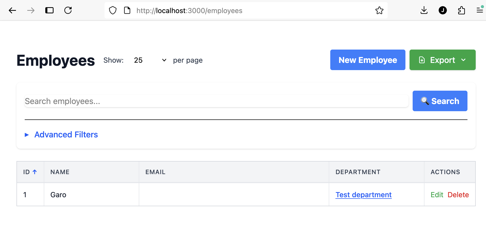
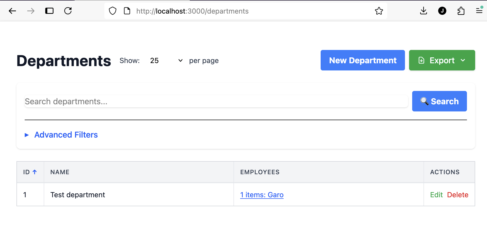

# ElaineCrud

A Rails engine for rapidly generating CRUD interfaces for ActiveRecord models with minimal configuration.


## Features

- **Zero Configuration**: Works out of the box with any ActiveRecord model
- **Rails Conventions**: Follows standard Rails patterns
- **Minimal Code**: Just specify model and permitted params
- **Search & Filter**: Built-in search across text fields
- **Sortable Columns**: Click column headers to sort
- **Pagination**: Automatic pagination with configurable page size
- **Export**: Download data as CSV, Excel, or JSON
- **Extensible**: Override any view or behavior in your host app

## Installation

Add to your `Gemfile`:

```ruby
gem 'elaine_crud'
```

Then run:
```bash
bundle install
```

## Quick Start

### 1. Ensure you have ActiveRecord model representing your data.

```bash
bin/rails generate model Task title:string description:text priority:integer completed:boolean due_date:date
bin/rails db:migrate
```

### 2. Create a Controller for your ActiveRecord Model

This controller handles one ActiveRecord model and presents a CRUD interface to the user. It derives from the ElaineCrud::BaseController, which provides good defaults for how the CRUD view should operate. The controller requires a working layout (see step 4).

The main configuration is setting the ActiveRecord model using the `model Task` keyword, where Task is an ActiveRecord model. You also need to explicitly specify which model fields are permitted using the `permit_params` command.

The following example controller provides a fully working CRUD view for the ActiveRecord with pagination, sorting, filtering and exporting. You can customise the behaviour, which is explained in more details later.

```ruby
class TaskController < ElaineCrud::BaseController
  layout 'application'  # Use your app's layout (wraps ElaineCrud's content)

  model Task
  permit_params :title, :description, :priority, :completed, :due_date
end
```

### 3. Add Routes

You need to add the created Controller to the Rails routes.rb. In this example you simply declare `resources :tasks` where `:tasks` maps to the TaskController.

```ruby
# config/routes.rb
Rails.application.routes.draw do
  resources :tasks
  root "tasks#index"
end
```

### 4. Ensure Your Application Has a Layout

ElaineCrud is a **content-only engine** - it provides CRUD views but relies on your application to provide the HTML structure (layout, navigation, styling).

Your Rails app should have a layout file (typically `app/views/layouts/application.html.erb`) that includes:
- Basic HTML structure (`<html>`, `<head>`, `<body>`)
- TailwindCSS stylesheets
- JavaScript imports (including Turbo)
- Navigation/header/footer (optional, your choice)

Here's an example layout file, which contains the critical stylesheet_link_tag for elaine_crud:

```erb
<!DOCTYPE html>
<html>
  <head>
    <title><%= content_for(:title) || "Taskmanager" %></title>
    <meta name="viewport" content="width=device-width,initial-scale=1">
    <%= csrf_meta_tags %>
    <%= csp_meta_tag %>

    <%= stylesheet_link_tag "elaine_crud", "data-turbo-track": "reload" %>
    <%= stylesheet_link_tag :app, "data-turbo-track": "reload" %>
    <%= javascript_importmap_tags %>
  </head>

  <body class="bg-gray-100">
    <main class="w-full px-4 py-6">
      <%= yield %>
    </main>
  </body>
</html>
```

### 5. Start Your Server

```bash
bin/dev
```

## Usage

### Extending the default Controller

As described earlier, this example controller uses a lot of default from the `ElaineCrud::BaseController`.

One of the first things user usually wants to customise is how a certain ActiveRecord property is rendered to the user.

```ruby
class TaskController < ElaineCrud::BaseController
  layout 'application'  # Use your app's layout (wraps ElaineCrud's content)

  model Task
  permit_params :title, :description, :priority, :completed, :due_date

  # Configures the ActiveRecord field :title
  field :title do |f|

    # Human readable name for the field, shown in the column header.
    f.title "Task title"

    # Description is shown in the edit form
    f.description "Write a short title for your task, so that it's easily understandable"

    # Custom rendering. `value` is the raw value of the field and `record` is the entire ActiveRecord
    f.display_as { |value, record| "<b>#{value}</b>" if value.present? }

    # By default text columns are searchable but not filterable. You can set a field to be filterable
    # so that it shows in Advanced Filters section, but then it's no longer searchable
    f.filterable true

    # By default text columns are searchable and other columns are not
    f.searchable false
  end

  field :priority do |f|
    # Gives a html dropdown for available options
    f.options [1,2,3,4,5]
  end

  # `read_only` can be used prevent field from being edited
  field :modified_at do |f|
    f.read_only true
  end

  # We can also hide a field completely
  field :created_at do |f|
    f.hidden true
  end

end
```

### Virtual fields

It is possible to create a virtual column which is not backed by any actual field in the ActiveRecord, but instead its contents is calculated based on other fields. For example if your Order has `amount` and `price_per_unit` fields, you could have a `total_cost` virtual field:

```ruby
class OrderController < ElaineCrud::BaseController
  layout 'application'  # Use your app's layout (wraps ElaineCrud's content)

  model Order
  permit_params :product, :amount, :price_per_unit

  # The field `total_cost` simply does not exists in the ActiveRecord model
  field :total_cost do |f|
    f.readonly true
    f.display_as { |value,record|
      # The `value` parameter will be nil as it does not exists.
      record.amount * record.price_per_unit
    }
  end
end
```

### Relations

ElaineCrud supports ActiveRecord relations automatically, if they are configured in the underlying ActiveRecords. Lets assume these models:
```
bin/rails generate model Department name:string
bin/rails generate model Employee name:string email:string department:references
bin/rails db:migrate

# app/models/department.rb
class Department < ApplicationRecord
  has_many :employees
end

# app/models/employee.rb
class Employee < ApplicationRecord
  belongs_to :department
end
```

We can then have a simple EmployeesController and DepartmentsController
```ruby
# app/controllers/employees_controller.rb
class EmployeesController < ElaineCrud::BaseController
  layout 'application'

  model Employee
  permit_params :name, :email, :department_id
end

# app/controllers/departments_controller.rb
class DepartmentsController < ElaineCrud::BaseController
  layout 'application'

  model Department
  permit_params :name

end
```

This will automatically create a relation to the Departments in the EmployeesController field like this:


Also the Departments controller will have a back reference to show how many Employees are boudn to the Department.



### Misc options
```ruby
# app/controllers/employees_controller.rb
class EmployeesController < ElaineCrud::BaseController
  layout 'application'

  model Employee
  permit_params :name, :email, :department_id

  # Sets default sorting when the controller is opened
  default_sort column: :email, direction: :asc

  # Instead of editing a row in the inline editor using turbo, the Edit button
  # opens /controller/#{id}/edit page
  disable_turbo

  # This adds a View button next to Edit and Delete buttons, which links to
  # /controller/#{id}
  show_view_button

  # Limit how many rows the export functionality will be exporting. The default is 10000
  max_export(5000)
end
```

## Requirements

- Rails 7.0+
- TailwindCSS (included via precompiled CSS)

## Examples

### More detailed example with customisations

A more comprehensive example showing custom field formatting, sorting, and relationships:

```ruby
# app/controllers/products_controller.rb
class ProductsController < ElaineCrud::BaseController
  layout 'application'

  model Product
  permit_params :name, :description, :price, :stock_quantity, :category_id, :active

  # Sort by name alphabetically by default
  default_sort column: :name, direction: :asc

  # Show the View button in actions column
  show_view_button

  # Format price as currency
  field :price do |f|
    f.title "Price"
    f.display_as { |value, record| number_to_currency(value) if value.present? }
  end

  # Custom display for stock status
  field :stock_quantity do |f|
    f.title "Stock"
    f.display_as { |value, record|
      if value.to_i > 10
        content_tag(:span, "#{value} in stock", class: "text-green-600")
      elsif value.to_i > 0
        content_tag(:span, "Low: #{value}", class: "text-yellow-600 font-semibold")
      else
        content_tag(:span, "Out of stock", class: "text-red-600 font-semibold")
      end
    }
  end

  # Boolean with badge display
  field :active do |f|
    f.title "Status"
    f.display_as { |value, record|
      if value
        content_tag(:span, "Active", class: "px-2 py-1 text-xs rounded bg-green-100 text-green-800")
      else
        content_tag(:span, "Inactive", class: "px-2 py-1 text-xs rounded bg-gray-100 text-gray-600")
      end
    }
  end

  # Foreign key - automatically renders as dropdown in forms
  field :category_id do |f|
    f.foreign_key model: Category, display: :name
  end
end
```

### Example Output

The generated interface includes:
- **Index Page**: Responsive grid-based table with all records
- **Inline Editing**: Click Edit to modify records in place (Turbo Frames)
- **Sortable Columns**: Click headers to sort ascending/descending
- **Search**: Filter records by text across searchable columns
- **Pagination**: Navigate through large datasets with configurable page size
- **Export**: Download as CSV, Excel (.xlsx), or JSON
- **Smart Formatting**: Dates, booleans, and nil values formatted nicely
- **Action Buttons**: Edit and Delete functionality
- **Empty States**: Helpful messages when no records exist
- **Visual Feedback**: Row highlights after saving changes

## Architecture

See [ARCHITECTURE.md](docs/ARCHITECTURE.md) for detailed technical documentation.

## Contributing

1. Open a new issue and suggest a feature
2. Fork the repository
3. Create a feature branch
4. Make your changes
5. Add tests
6. Submit a pull request

## License

MIT License. See [LICENSE](LICENSE) for details.