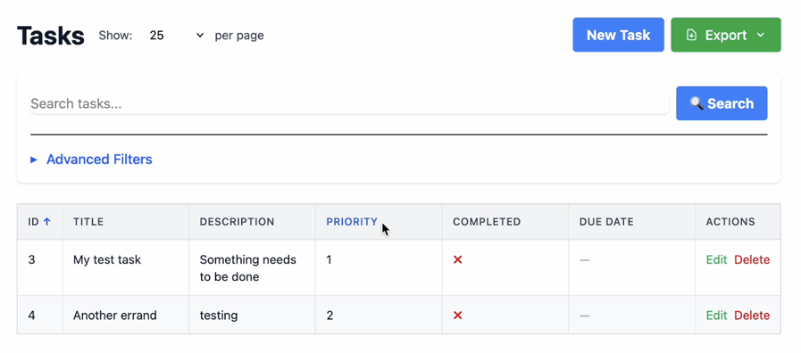

# ElaineCrud

A Rails engine for rapidly generating CRUD interfaces for ActiveRecord models with minimal configuration.



## Features

- **Zero Configuration**: Works out of the box with any ActiveRecord model
- **Rails Conventions**: Follows standard Rails patterns
- **Minimal Code**: Just specify model and permitted params
- **Search & Filter**: Built-in search across text fields
- **Sortable Columns**: Click column headers to sort
- **Pagination**: Automatic pagination with configurable page size
- **Export**: Download data as CSV, Excel, or JSON
- **Extensible**: Override any view or behavior in your host app
- **Modern UI**: Clean, responsive interface with TailwindCSS
- **Inline Editing**: Edit records in place with Turbo Frames

## Installation

Add to your `Gemfile`:

```ruby
gem 'elaine_crud'
```

Then run:
```bash
bundle install
```

## Quick Start

### 1. Ensure you have ActiveRecord model representing your data.

```bash
bin/rails generate model Task title:string description:text priority:integer completed:boolean due_date:date
bin/rails db:migrate
```

### 2. Create a Controller for your ActiveRecord Model

Specify which layout ElaineCrud should use with the `layout` directive:

```ruby
class TaskController < ElaineCrud::BaseController
  layout 'application'  # Use your app's layout (wraps ElaineCrud's content)

  model Task
  permit_params :title, :description, :priority, :completed, :due_date
end
```
**Important**: The `layout 'application'` line tells ElaineCrud to render its CRUD views inside your application's layout. Without this, you'll see unstyled content with no HTML structure.


### 3. Add Routes

```ruby
# config/routes.rb
Rails.application.routes.draw do
  resources :tasks
  root "tasks#index"
end
```

### 4. Ensure Your Application Has a Layout

ElaineCrud is a **content-only engine** - it provides CRUD views but relies on your application to provide the HTML structure (layout, navigation, styling).

Your Rails app should have a layout file (typically `app/views/layouts/application.html.erb`) that includes:
- Basic HTML structure (`<html>`, `<head>`, `<body>`)
- TailwindCSS stylesheets
- JavaScript imports (including Turbo)
- Navigation/header/footer (optional, your choice)

Here's an example layout file, which contains the critical stylesheet_link_tag for elaine_crud:

```erb
<!DOCTYPE html>
<html>
  <head>
    <title><%= content_for(:title) || "Taskmanager" %></title>
    <meta name="viewport" content="width=device-width,initial-scale=1">
    <%= csrf_meta_tags %>
    <%= csp_meta_tag %>

    <%= stylesheet_link_tag "elaine_crud", "data-turbo-track": "reload" %>
    <%= stylesheet_link_tag :app, "data-turbo-track": "reload" %>
    <%= javascript_importmap_tags %>
  </head>

  <body class="bg-gray-100">
    <main class="w-full px-4 py-6">
      <%= yield %>
    </main>
  </body>
</html>
```

### 5. Start Your Server

```bash
bin/dev
```

## Usage

### Basic Controller

The minimal controller setup:

```ruby
class ArticlesController < ElaineCrud::BaseController
  layout 'application'  # Host app controls layout (header/footer/styling)
  
  model Article
  permit_params :title, :content, :published
end
```

### DSL Reference

- `model(ModelClass)` - Specify the ActiveRecord model to manage
- `permit_params(*attrs)` - Define permitted attributes for strong parameters
- `field(field_name, **options)` - Configure individual field display and behavior
- `default_sort(column:, direction:)` - Set default sort column and direction (:asc or :desc)
- `disable_turbo` - Disable Turbo Frames (use full-page navigation instead of inline editing)
- `show_view_button(enabled)` - Show/hide the View button in actions column
- `max_export(limit)` - Set maximum records for export (default: 10,000)

### Customization

#### Override Views

Create views in your app with the same names to override engine views:

```
app/views/articles/index.html.erb  # Overrides engine's index view
```

#### Override Controller Methods

```ruby
class ArticlesController < ElaineCrud::BaseController
  model Article
  permit_params :title, :content, :published
  
  private
  
  # Custom record fetching with scoping
  def fetch_records
    Article.published.order(:title)
  end
  
  # Custom column selection
  def determine_columns
    %w[title published created_at]
  end
end
```

#### Custom Helpers

Override the display helper in your application:

```ruby
# app/helpers/application_helper.rb
def display_column_value(record, column)
  case column
  when 'published'
    record.published? ? '📘 Published' : '📝 Draft'
  else
    super # Call the engine's helper
  end
end
```

## Requirements

- Rails 7.0+
- TailwindCSS (included via precompiled CSS)

## Examples

### Complete Example: Managing Blog Posts

```ruby
# app/controllers/posts_controller.rb
class PostsController < ElaineCrud::BaseController
  layout 'application'  # Use your app's layout
  
  model Post
  permit_params :title, :content, :published, :category_id
  
  private
  
  def fetch_records
    Post.includes(:category).order(created_at: :desc)
  end
end

# config/routes.rb
resources :posts

# Navigate to /posts for instant CRUD interface
```

### Example Output

The generated interface includes:
- **Index Page**: Responsive grid-based table with all records
- **Inline Editing**: Click Edit to modify records in place (Turbo Frames)
- **Sortable Columns**: Click headers to sort ascending/descending
- **Search**: Filter records by text across searchable columns
- **Pagination**: Navigate through large datasets with configurable page size
- **Export**: Download as CSV, Excel (.xlsx), or JSON
- **Smart Formatting**: Dates, booleans, currencies, and nil values formatted nicely
- **Action Buttons**: Edit and Delete functionality
- **Empty States**: Helpful messages when no records exist
- **Visual Feedback**: Row highlights after saving changes

## Architecture

ElaineCrud follows a **separation of concerns** approach:

- **Engine provides**: CRUD logic, data formatting, content templates
- **Host app provides**: Layout, styling, HTML structure, navigation

### Layout Control

The gem doesn't impose any layout - your app controls the HTML structure:

```ruby
class UsersController < ElaineCrud::BaseController
  layout 'admin'        # Use admin layout
  # or layout 'public'  # Use public layout
  # or layout false     # No layout (API mode)
  
  model User
  permit_params :name, :email
end
```

This means:
- **Your app controls**: Headers, footers, navigation, CSS frameworks
- **Engine provides**: Table content, buttons, data formatting
- **Zero view files needed**: No templates to create in your app

See [ARCHITECTURE.md](docs/ARCHITECTURE.md) for detailed technical documentation.

## Contributing

1. Fork the repository
2. Create a feature branch
3. Make your changes
4. Add tests
5. Submit a pull request

## License

MIT License. See [LICENSE](LICENSE) for details.